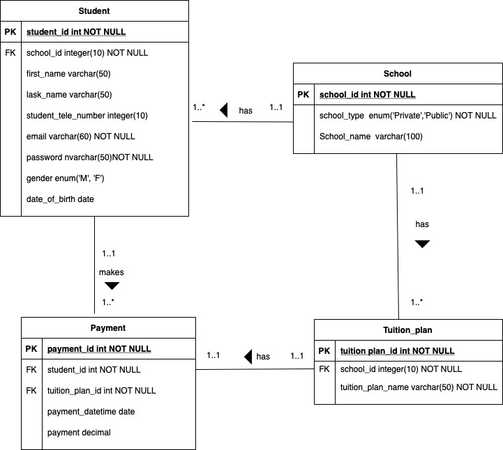

# Student Tuition Billing System
*The goal of this repository is to create a student tuition billing system.*

Getting Started
-----
Requirements

1.Maven 3.0+

2.IDE(Eclipse or IntelliJ)

3.JDK 1.8+

**Step 1: Create the Spring Boot Project from [Spring Initializr](https://start.spring.io)**

- Add the following dependencies
1.WEB
2.JPA
3.MYSQL

- Then click “Generate”. You will find a rar file — extract it. Then open that folder in your favorite IDE.

**Step 2: Create database**

- Create the Databse tables using [Database script](https://github.com/AndreaNim/Student-Billying-System/tree/master/DB%20scripts) in MySQL database server.

- Define connection properties in /src/main/resources/application.properties

**Step 3: Build and Run the Project**

- The app will start running at http://localhost:8080.

**Step 4: Run the client application in local web server**

- open up the terminal or command prompt
- navigate to the directory where the files
- run a local python server by running:

    ```
    python3 -m http.server 1234
    ```

- Go to http://localhost:1234/login.html in your browser